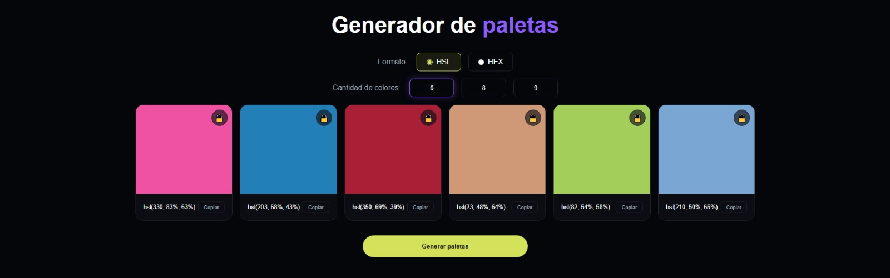
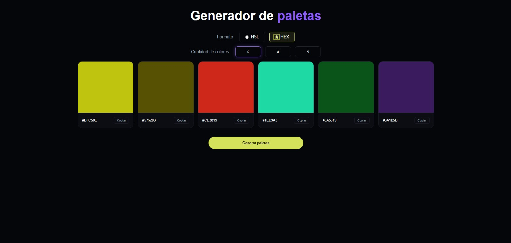
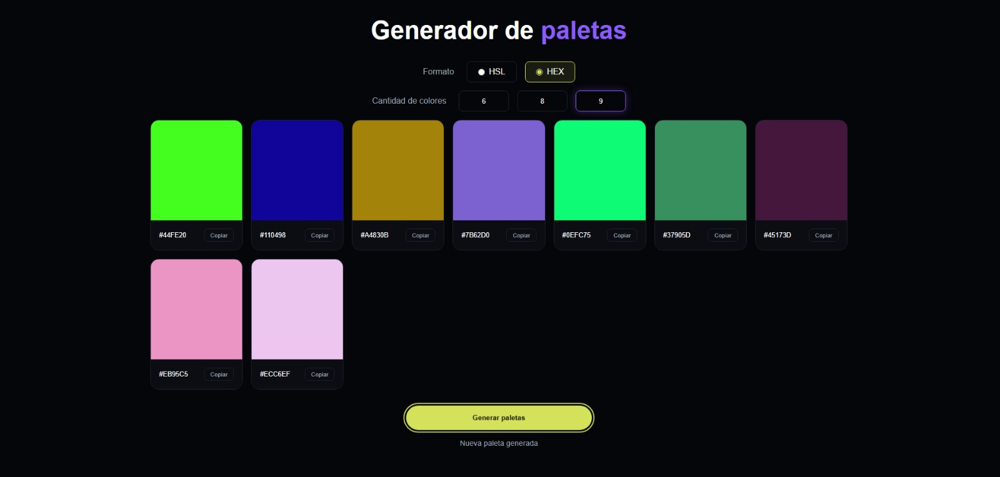
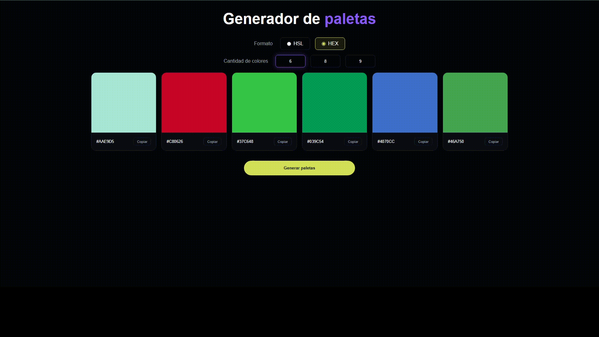

# ProyectoM1_MartinBlanco

# Generador de Paletas de Colores

Aplicación web interactiva desarrollada como Proyecto Integrador del Módulo 1 de Henry.

Permite generar paletas de colores dinámicas en formatos HEX y HSL, seleccionar diferentes cantidades de colores y copiar valores al portapapeles de forma rápida.

---

## Demo Online

https://marblanco.github.io/ProyectoM1_MartinBlanco/

---

## Capturas del Proyecto

### Vista General








---

## Funcionalidades Implementadas

### Selección de Formato

* HEX
* HSL


---

### Generación Dinámica de Paletas

* Generación aleatoria de colores
* Actualización dinámica del DOM
* Selección de 6, 8 o 9 colores


---

### Copia al Portapapeles

* Copia instantánea del color seleccionado
* Feedback visual para el usuario


---

## Demo Animada



## Instalación y Ejecución Local

Clonar el repositorio:

```bash
git clone https://github.com/MarBlanco/ProyectoM1_MartinBlanco.git
```

Ingresar al proyecto:

```bash
cd ProyectoM1_MartinBlanco
```

Abrir:

```txt
index.html
```

en cualquier navegador moderno.

---

## Tecnologías Utilizadas

* HTML5
* CSS3
* JavaScript
* DOM API
* Clipboard API

---

## Características Técnicas

* Renderizado dinámico mediante JavaScript.
* Generación aleatoria de colores HEX y HSL.
* Manipulación dinámica del DOM.
* Event Listeners para interacción del usuario.
* Copia al portapapeles mediante Clipboard API.
* Variables CSS para mantener consistencia visual.
* Responsive Design.
* Accesibilidad básica mediante focus visible y atributos ARIA.

---

## Estructura del Proyecto

```txt
ProyectoM1_MartinBlanco
│
├── assets
│   ├── capturas
│   ├── promps IA
│   └── images
│
├── css
│   └── style.css
│
├── js
│   └── app.js
│
├── index.html
└── README.md
```

---

## Autor

Martín Blanco

Proyecto Integrador - Módulo 1

Bootcamp Full Stack Developer - Henry
